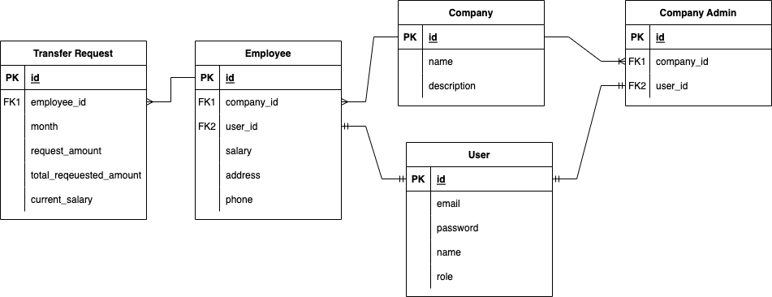

## Installation (Development)

```bash
$ npm install
```

Please create an `.env` file similar to [.env.example](.env.example)

## Database setup

```bash
## Start postgres database in docker
$ docker-compose -f docker-compose-db-only.yml up -d 

## Run tables creation
$ npm run schema:sync

## Add system admin to database
$ npm run apply:migration
```

## Running the app

```bash
# development
$ npm run start

# watch mode
$ npm run start:dev

# production mode
$ npm run start:prod
```

The swagger UI will be available at http://localhost:3000/api/# by default

### Implementation notes

- The transfer request from employee is created in transaction
  mode [transfer-requests.service.ts](./src/modules/transfer-requests/transfer-requests.service.ts)
- Database entities
  

**Built-in Features**

- 📱 **NestJS** — latest version
- 🎉 **TypeScript** - Type checking
- ⚙️ **Dotenv** - Supports environment variables
- 🗝 **Authentication** - JWT, RSA256
- 🏬 **Authorization** - RBAC, CBAC
- 🏪 **TypeORM** - Database ORM
- 🏪 **PostgreSQL** - Open-Source Relational Database
- 🧠 **Configuration** - Single config for all
- 📃 **Swagger** - API Documentation
- 🐳 **Docker Compose** - Container Orchestration
- 🔐 **Helmet** - secure HTTP headers
- 😴 **Insomnia** - Insomnia config for endpoints
- 📏 **ESLint** — Pluggable JavaScript linter
- 💖 **Prettier** - Opinionated Code Formatter
- ✨ **Commitlint** - Lint your conventional commits
